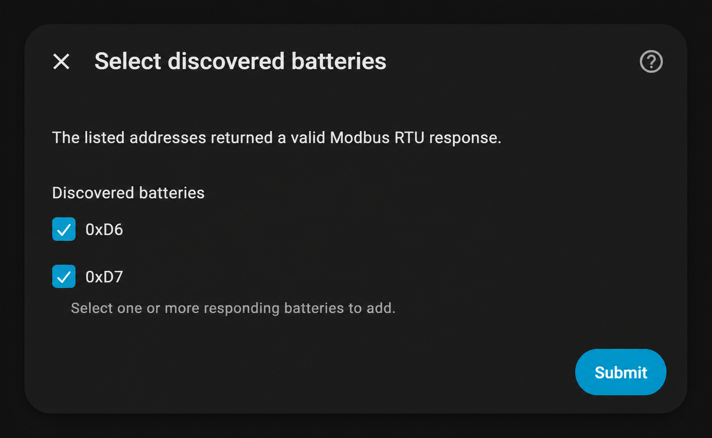
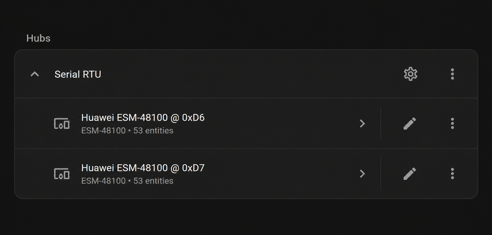
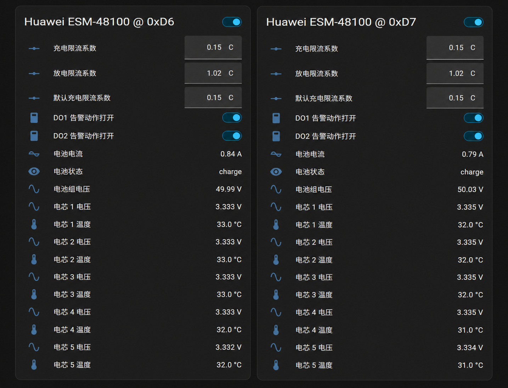

# Huawei ESM-48100 for Home Assistant

一个面向 Huawei ESM-48100 电池的 HACS 自定义集成，支持：

- USB/本地串口上的 Modbus RTU；
- TCP 透明串口服务器转发的完整 Modbus RTU 帧；
- 一条 RS485 总线配置多个从站地址；
- `DataUpdateCoordinator` 统一轮询；
- UI 配置流和诊断下载；
- 电压、电流、SOC、SOH、状态、统计量、软件版本、电池条码和电子标签档案；
- 1–24 节单体电压/温度、最高/最低电压和压差；
- 五个告警字的汇总问题实体。
- 休眠电池的只读唤醒、超时/CRC 重试和异常尾随数据恢复。

## 当前状态

当前映射基于两台 ESM-48100B1、软件版本 V112 的抓包，并由华为协议
1.02 和上位机静态分析印证。其他子型号或固件仍需独立验证。

电池条码作为独立诊断传感器显示。电子标签档案超过 Home Assistant 实体状态
的长度限制，因此“电子标签档案”传感器的状态为 `loaded`，完整 ASCII 文本
保存在该实体的 `text` 属性中；标签仅在每次集成加载后的首次快照中读取并缓存。

高级控制实体默认关闭且不会创建，底层协议传输保持只读。只有在配置时显式
启用，集成才允许写入三个限流系数和 DO1/DO2 告警动作；每次写入都有范围、
响应回显和写后读回校验。MOS、混用、DOD、最大功率、校准、陀螺仪、复位和
时间同步始终不开放。

## 界面预览

自动扫描会列出返回有效 Modbus RTU 响应的电池地址：



一个总线配置项可以管理多个电池设备：



将所需实体加入仪表盘后，可以并排查看两块电池；高级控制仅在选项中显式
启用后显示：



## 开发环境

协议库是独立的
[`huawei-esm48100`](https://github.com/GImDX/huawei-esm48100) 项目。
并排检出两个仓库时，本地路径为 `../huawei-esm48100`。先以 editable 模式
安装协议库：
当前 Home Assistant 2026.7 开发环境要求 Python 3.14.2 或更高版本。

```bash
python -m pip install -r requirements-test.txt
pytest
```

完整 Home Assistant 运行时测试位于 `tests/ha/`，使用模拟 transport 和
protocol client，不会连接真实串口、TCP 网关或发送写请求。覆盖率检查命令：

```bash
pytest tests/ha \
  --cov=custom_components.huawei_esm48100 \
  --cov-report=term-missing
```

Home Assistant 运行时依赖 POSIX 接口，完整测试应在 Linux 上执行；仓库的
`home-assistant-tests` GitHub Actions job 会并排检出协议库并运行上述命令。
原生 Windows 开发环境可执行 Ruff、编译检查和不依赖 HA 的测试：

```powershell
$env:PYTEST_DISABLE_PLUGIN_AUTOLOAD = "1"
pytest tests --ignore=tests/ha
Remove-Item Env:PYTEST_DISABLE_PLUGIN_AUTOLOAD
```

如果没有安装 `requirements-test.txt` 中的 Home Assistant 测试依赖，
`tests/ha/` 会被跳过，仓库结构和纯 helper 测试仍可独立执行。

然后把 `custom_components/huawei_esm48100` 链接或复制到 Home Assistant 的
`config/custom_components/`。

## HACS 安装

在 HACS 的“自定义仓库”中添加：

```text
https://github.com/GImDX/huawei-esm48100-home-assistant
```

类别选择 `Integration`，然后安装 **Huawei ESM-48100** 并重启 Home
Assistant。集成会根据 `manifest.json` 自动从 PyPI 安装固定版本的
`huawei-esm48100` 协议库。

## 配置

在 Home Assistant 中添加 **Huawei ESM-48100**，选择：

- **Serial RTU**：填写稳定串口路径（Linux 推荐 `/dev/serial/by-id/...`）、
  波特率、校验位和从站地址。
- **TCP RTU (transparent gateway)**：填写串口服务器主机、端口和从站地址。

### Home Assistant Container 串口透传

使用 Home Assistant Container 时，宿主机上的 USB-RS485 设备不会自动出现在
容器中。先在 Linux 宿主机确认稳定设备路径及其实际字符设备：

```bash
ls -l /dev/serial/by-id/
readlink -f /dev/serial/by-id/usb-...
```

假设稳定路径最终指向 `/dev/ttyUSB0`，需要重新创建容器，并在原有
`docker run` 命令中增加：

```bash
--device=/dev/ttyUSB0:/dev/ttyUSB0 \
-v /dev/serial/by-id:/dev/serial/by-id:ro
```

Docker Compose 的等效配置为：

```yaml
services:
  homeassistant:
    devices:
      - /dev/ttyUSB0:/dev/ttyUSB0
    volumes:
      - /path/to/homeassistant-config:/config
      - /dev/serial/by-id:/dev/serial/by-id:ro
```

如果 `readlink -f` 返回其他设备名，应相应替换两处 `/dev/ttyUSB0`。容器启动后
可以验证设备和稳定链接是否可见：

```bash
docker exec homeassistant sh -c \
  'ls -l /dev/ttyUSB0 /dev/serial/by-id/'
```

随后在集成的 Serial RTU 配置中填写容器内的
`/dev/serial/by-id/usb-...` 完整路径。无需为此启用
`privileged: true`；上述设备和只读目录映射已经足够。若容器名称不是
`homeassistant`，请替换验证命令中的名称。

从站地址支持逗号分隔的十进制或 `0x` 十六进制格式，例如：

```text
0xD6, 0xD7
```

连接参数提交后，可以选择自动扫描或手工输入地址。自动扫描默认覆盖已验证的
`0xD6–0xDD` 和 `0xE0–0xE7`，也可指定 `1–247` 内的其他地址列表和扫描
轮数。默认执行 14 轮；每轮都向全部所选地址发送一次只读
`0x03/0x0000 × 1` 请求，包括已经响应的地址，单次扫描响应超时最多为
0.3 秒。发现结束后，可从响应地址列表中选择要加入此总线配置的电池。扫描
期间即使启用了高级控制实体，transport 也会强制保持禁止写入。

从现有配置项发起“重新配置”时，集成会在手工验证或扫描实际运行期间临时
卸载旧配置项、停止保活并关闭旧 transport，操作结束后再恢复，因此同一个
Home Assistant 实例不会用新旧连接同时访问总线。通过“添加集成”启动全新
配置流程不具备这一暂停行为；同一物理 RS485 总线已有配置项时应使用
“重新配置”。

TCP 模式不是 Modbus TCP；网关必须透明转发带 CRC 的 RTU 帧。
Serial RTU 会根据串口参数自动保证至少 3.5 个字符时间、且不低于 10 ms 的
“完整响应结束至下一请求开始”静默，无需在扫描或采集间隔中另行补偿。

首次连接会使用只读 `0x0000 × 1` 请求唤醒休眠电池，并在最多 60 秒的恢复
窗口内处理超时、CRC 错误和异常尾随数据。默认每 30 秒完整采集一次动态
参数，并每 10 秒执行一次轻量只读保活；两者都可在集成选项中调整。

启用高级控制后，每块电池额外创建：

- 充电、放电和默认充电限流系数 number 实体；
- DO1、DO2 告警动作 switch 实体。

## 安全说明

本项目与 Huawei 无关联。连接真实电池前应确认串口电气规格、接地、隔离和
通信参数。协议证据和已知差异见协议库的
[`PROTOCOL.md`](https://github.com/GImDX/huawei-esm48100/blob/main/PROTOCOL.md)。
错误接线或未经验证的写操作可能造成设备损坏或人身风险。
